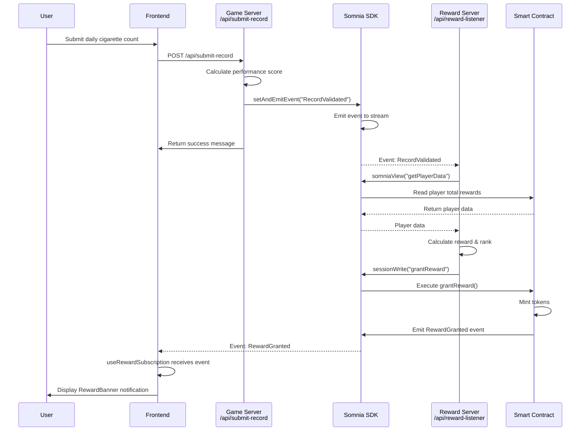
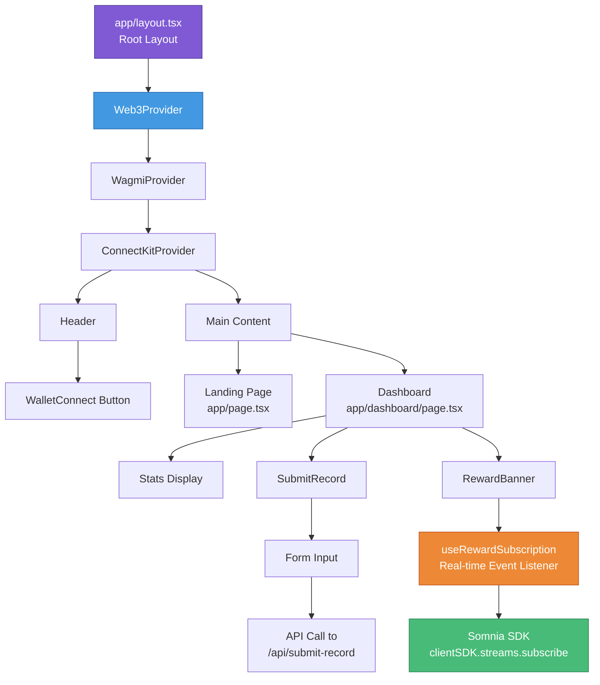
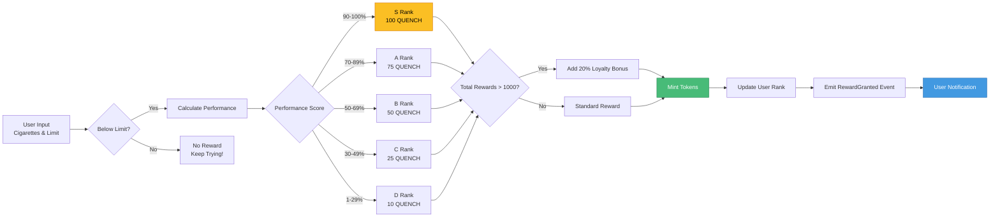

# Curious Quench 


A Web3 gamified app to help you quit smoking. Track your daily cigarette consumption and earn **$QUENCH** tokens based on your progress!

## Features

- 🎯 **Daily Tracking**: Submit your cigarette count and set daily limits
- 🏆 **Rank System**: Progress through ranks D, C, B, A, and S based on performance
- 💰 **Token Rewards**: Earn $QUENCH tokens for staying below your daily limit
- ⛓️ **Blockchain Powered**: Built on Somnia blockchain for transparency
- 🔔 **Real-time Notifications**: Get instant reward notifications

## Tech Stack

- **Frontend**: Next.js 14+ (App Router)
- **Wallet Integration**: ConnectKit + Wagmi
- **Blockchain**: Somnia Network
- **SDK**: @somnia-chain/streams
- **Smart Contract**: CuriousQuench.sol (ERC20)


### Event Flow Sequence



### Component Hierarchy



### Data Flow



## Project Structure

```
curious-quench/
├── app/
│   ├── api/
│   │   ├── submit-record/route.ts      # Game server endpoint
│   │   └── reward-listener/route.ts    # Reward server endpoint
│   ├── dashboard/page.tsx              # User dashboard
│   └── page.tsx                        # Landing page
├── components/
│   ├── WalletConnect.tsx               # Wallet connection
│   ├── SubmitRecord.tsx                # Daily record form
│   ├── RewardBanner.tsx                # Reward notifications
│   ├── Header.tsx                      # Navigation header
│   └── Web3Provider.tsx                # Web3 context provider
├── lib/
│   ├── somnia-sdk.ts                   # SDK initialization
│   ├── contract.ts                     # Contract address & ABI
│   └── calculations.ts                 # Reward calculations
└── hooks/
    └── useRewardSubscription.ts        # Real-time reward listener
```

## Setup

### 1. Install Dependencies

```bash
bun install
```

### 2. Environment Variables

Copy `.env.example` to `.env.local` and fill in the values:

```bash
cp .env.example .env.local
```

Required variables:
- `NEXT_PUBLIC_SOMNIA_RPC_URL`: Somnia RPC endpoint
- `NEXT_PUBLIC_CHAIN_ID`: Somnia chain ID (50311)
- `NEXT_PUBLIC_CONTRACT_ADDRESS`: Your deployed contract address
- `REWARD_SERVER_PRIVATE_KEY`: Private key for reward server wallet
- `REWARD_SERVER_ADDRESS`: Address of reward server wallet

### 3. Deploy Smart Contract

1. Open Remix IDE
2. Deploy `CuriousQuench.sol` to Somnia network
3. Copy the deployed contract address to `.env.local`
4. Update `lib/contract.ts` with the contract ABI (if needed)
5. Call `setRewardServer()` from owner wallet to set the reward server address

### 4. Start Development Server

```bash
bun dev
```

Visit [http://localhost:3000](http://localhost:3000)

### 5. Start Reward Listener

The reward listener must be running to process rewards. Start it by making a GET request:

```bash
curl http://localhost:3000/api/reward-listener
```

Or visit the endpoint in your browser. The listener will continue running in the background.

## How It Works

### Event Flow

1. **User submits** daily cigarette count via `SubmitRecord` component
2. **Game Server** (`/api/submit-record`) validates against daily limit
3. **Game Server** calls `sdk.streams.setAndEmitEvent()` to emit `RecordValidated` event
4. **Reward Server** (`/api/reward-listener`) listens via `sdk.streams.subscribe()`
5. **Reward Server** calculates reward and calls `sdk.streams.sessionWrite()` to execute `grantReward()`
6. **Smart Contract** mints tokens and emits `RewardGranted` event
7. **Frontend** receives event via `useRewardSubscription` hook
8. **RewardBanner** displays reward notification

### Rank System

| Rank | Performance | Token Reward | Description |
|------|-------------|--------------|-------------|
| **S** | 90-100% | 100 $QUENCH | Exceptional progress |
| **A** | 70-89% | 75 $QUENCH | Great progress |
| **B** | 50-69% | 50 $QUENCH | Good progress |
| **C** | 30-49% | 25 $QUENCH | Moderate progress |
| **D** | 1-29% | 10 $QUENCH | Minor progress |

**Performance Formula**: `((dailyLimit - cigaretteCount) / dailyLimit) × 100`

**Loyalty Bonus**: Users with 1000+ total rewards get 20% extra tokens!

## Deployment Checklist

- [ ] Deploy smart contract to Somnia
- [ ] Configure environment variables
- [ ] Update contract ABI in `lib/contract.ts` (if needed)
- [ ] Set reward server address in contract
- [ ] Deploy Next.js app (Vercel/similar)
- [ ] Start reward listener service
- [ ] Test wallet connection
- [ ] Test full flow: submit → validate → reward → notify

## SDK Methods Used

- `sdk.streams.subscribe(eventId, viewCalls, callback)` - Listen for events
- `sdk.streams.setAndEmitEvent(id, type, data, eventId)` - Emit events
- `sdk.streams.sessionWrite(functionName, args)` - Execute contract functions
- `sdk.streams.somniaView(functionName, args)` - Read contract state

## License

MIT

---

**Remember**: Quitting smoking is a journey. Every step counts! 💪
